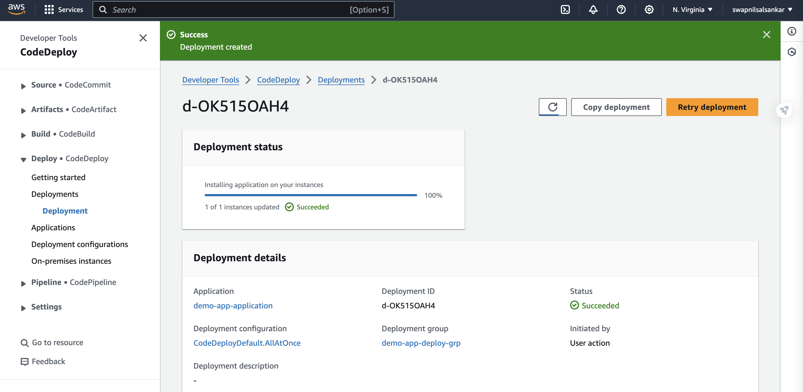

# CICD pipeline on AWS with CodePipeline

**Overview**

This project establishes a comprehensive CI/CD (Continuous Integration/Continuous Deployment) pipeline on AWS leveraging various services such as CodeCommit, CodeBuild, CodeDeploy, CodePipeline, AWS S3, KMS, EC2, and Kubernetes. The primary goal is to streamline the integration and deployment process while ensuring robust security measures and system reliability.

**Features**

Seamless Integration: 
Achieved a seamless integration process by incorporating CodeCommit, CodeBuild, CodeDeploy, and CodePipeline.

Security Measures: 
Implemented robust security measures using AWS Key Management Service (KMS) for data encryption, integration with S3 for artifact storage, and IAM policies to ensure data confidentiality and integrity, achieving a compliance rate of 95%.

Docker Image Deployment:
 Orchestrated the deployment of Docker images to Amazon Elastic Container Registry (ECR), incorporating rollback capabilities to maintain system reliability and reducing server provisioning time.

NGINX Installation and Configuration: 
Automated the installation and configuration of NGINX using buildspec YAML and appspec files on EC2 instances for hosting web applications.

**Setup Instructions**

Clone Repository: Clone the repository from CodeCommit using appropriate credentials.

Configure AWS Credentials: Ensure that AWS credentials are properly configured with appropriate permissions.

Set Up KMS Encryption: Configure KMS for encryption purposes to secure sensitive data.

Create CodePipeline: Set up a CodePipeline with appropriate stages for continuous integration and continuous deployment.

Configure CodeBuild: Configure CodeBuild to build artifacts and run tests as per project requirements.

Set Up CodeDeploy: Configure CodeDeploy for deployment orchestration, ensuring rollback capabilities and reliability.

EC2 Configuration: Provision EC2 instances and configure them with necessary security groups and IAM roles.

Docker Image Deployment: Configure Docker image deployment to Amazon ECR, ensuring versioning and rollback capabilities.

NGINX Configuration: Use buildspec YAML and appspec files to automate the installation and configuration of NGINX on EC2 instances.

**Usage**

Push changes to the CodeCommit repository.
CodePipeline automatically triggers the CI/CD process.
CodeBuild builds artifacts and runs tests.
CodeDeploy orchestrates the deployment process.
Monitor pipeline execution and troubleshoot any issues as necessary.
